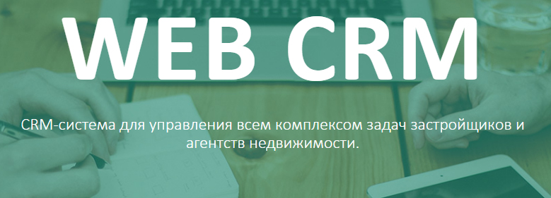
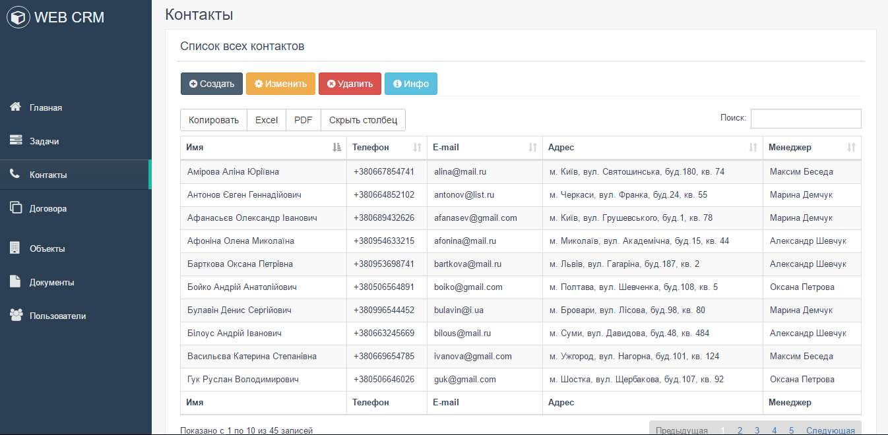
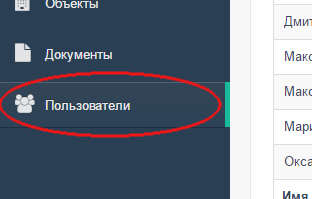

[WebCrm](http://web-crm.ml) это CRM-система для управления всем комплексом задач застройщиков и агентств недвижимости.

**Используемые технологии**: Java EE, Maven, Spring Boot, Spring MVC, Spring Data, Spring Security, JPA/Hibernate, MySQL, JSP/JSTL, Bootstrap, CSS, JavaScript.

WebCrm предназначена для автоматизации стратегий взаимодействия с клиентами, в частности для повышения уровня продаж, улучшения обслуживания клиентов путём сохранения информации о клиентах и истории взаимоотношений с ними.
WebCrm - это единая база для всех договоров, документов и объектов компании.

<h4>База данных</h4>
Вся информация в системе представлена в виде динамических таблиц информацию в которых можно сортировать и фильтровать по любому параметру. Есть возможность экспортировать необходимые данные в файл Excel или PDF.
В системе предусмотрено распределение всех пользователей по ролям: администраторы, руководители, менеджеры по продажам, менеджеры договорного отдела.

<h4>Администраторы</h4>
Пользователь с ролью ADMIN.
Администраторам предоставлен полный функционал системы (добавление, редактирование и удаление информации в любом разделе)
Только администраторы могут добавлять изменять и удалять пользователей системы в соответствующем разделе.
Вкладка "Пользователи" доступна только администраторам.

<h4>Руководители</h4>
Пользователь с ролью HEAD_SALES_MANAGER.
Руководителю доступны все функции администратора, кроме добавления изменения и удаления пользователей системы.
Во вкладке "Документы" только пользователь с ролью руководителя может перевести документ в статус "Согласовано" или "Отказано".

<h4>Менеджер договорного отдела</h4>
Пользователь с ролью CONTRACT_MANAGER.
Менеджеру договорного отдела доступны все функции, кроме добавления изменения и удаления пользователей системы, согласования документов.

<h4>Менеджер по продажам</h4>
Пользователь с ролью SALES_MANAGER.
Для менеджеров по продажам актуальны все выше перечисленные ограничения, а так же запрещено изменять и удалять договора и объекты, соответствующие кнопки будут не активны.

[_**Максим Беседа**_](https://ua.linkedin.com/in/maxim-beseda-b6971012a)
